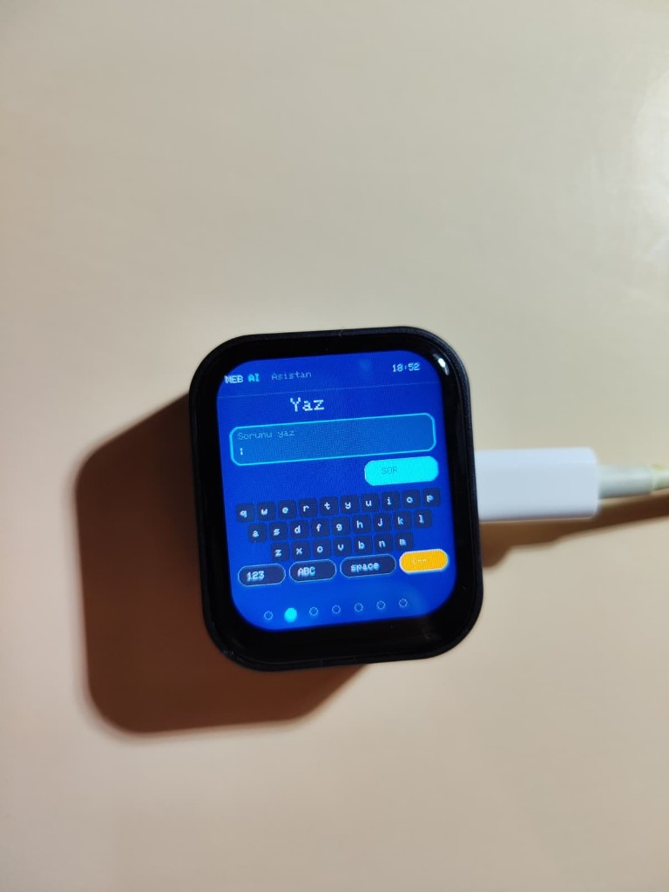
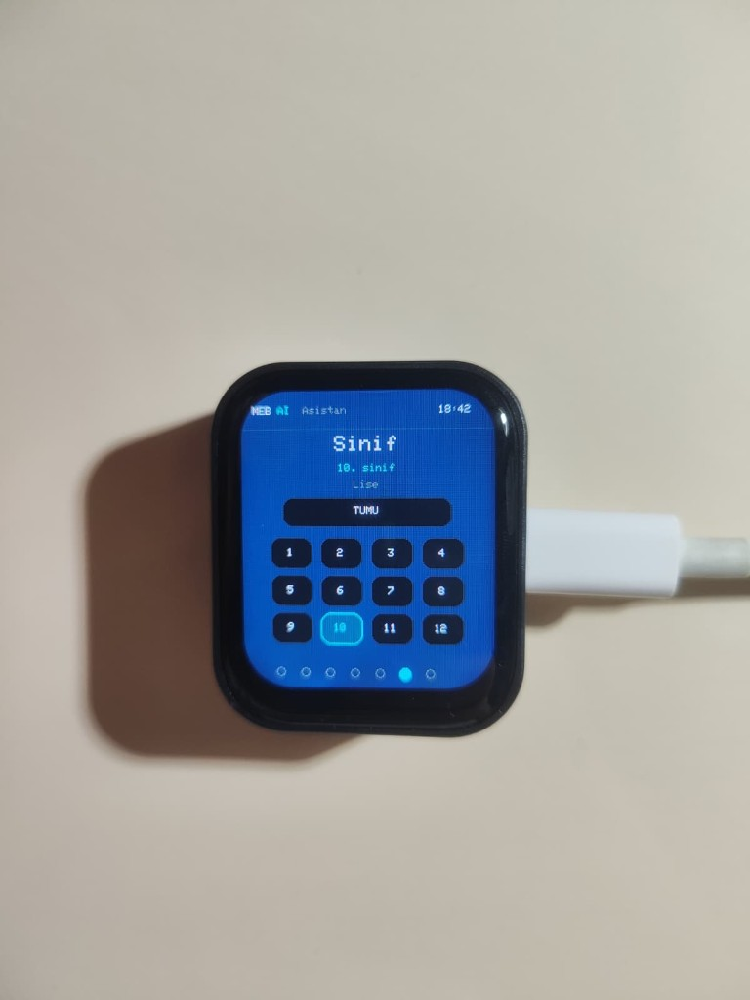

# MEB AI Asistan

End-to-end voice assistant prototype for education content: ESP32 client, FastAPI backend with RAG, and a small web dashboard.

## Architecture

```
ESP32 (mic / speaker / UI)
        │ WebSocket
        ▼
FastAPI  →  STT → RAG (Qdrant) → LLM → TTS
        │
        ▼
Web dashboard (parent / teacher)
```

| Path | Role |
|------|------|
| `01-Cihaz-Yazilimi/` | ESP32 firmware |
| `02-Backend-Sunucu/` | API, voice pipeline, dashboard host |
| `03-Veri-RAG/dokumantasyon/` | How book data is prepared |
| `04-Dashboard-Web/` | Dashboard UI |
| `06-Sunum-Tek-Tus/` | Local start / stop scripts |

Large book/vector dumps are not in this repo; rebuild them locally when needed.

## On the device

ESP32 client on hardware (prototype photos):

| Ready | Type a question | Grade |
| --- | --- | --- |
|  |  |  |

## Setup

### Backend

1. Copy `02-Backend-Sunucu/.env.example` → `.env` and set `GROQ_API_KEY`
2. Start Qdrant on `localhost:6333`
3. Create a venv, install `requirements.txt`
4. Run:

```bash
uvicorn main:app --host 0.0.0.0 --port 8001
```

Dashboard: `http://127.0.0.1:8001/dashboard/`

### Device

1. Copy `01-Cihaz-Yazilimi/esp32-asistan/wifi_local.h.example` → `wifi_local.h`
2. Fill Wi-Fi SSID/password and backend host IP
3. Flash `esp32-asistan` with Arduino IDE

`wifi_local.h` and `.env` are gitignored.

## Stack

Python · FastAPI · Qdrant · Groq · Edge TTS · ESP32 · JavaScript
